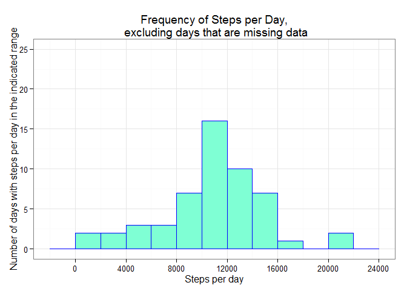
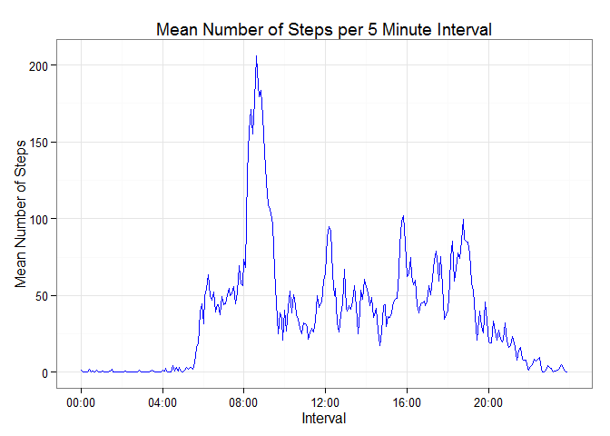
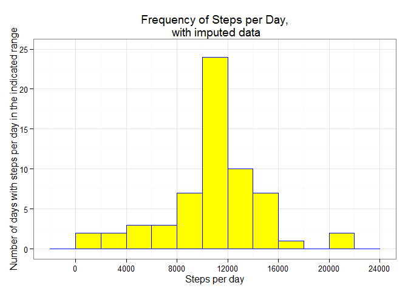
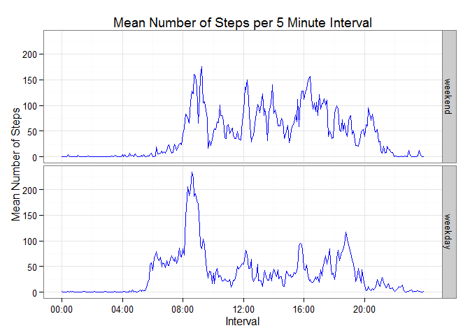

# Reproducible Research: Peer Assessment 1


## Preparing to work

We prepare by setting options for figures directory, and for display of numbers.

```r
# set to name the figures directory as "figures"
knitr::opts_chunk$set(fig.path='figure/')

# set to _not_ use scientific (exponential) notation
options("scipen" = 999)
```

We load required libraries.


```r
# load libraries
library(dplyr)
library(lubridate)
library(ggplot2)
library(scales)
```

We create a  data folder, if it does not exist.


```r
# create data folder, if it does not already exist
if (!file.exists("data")) {
        dir.create("data")
}
```

If the zipped data file does not already exist in the data folder in the working directory, we acquire the data.


```r
# download data, if it has not already been downloaded
target_url <- "https://d396qusza40orc.cloudfront.net/repdata%2Fdata%2Factivity.zip"
target_localfilename = "repdata_data_activity.zip"
target_localfile = paste0("./data/", target_localfilename)

# This method of creating download metadata is from David Hood, 
# Community Teaching Assistant for several Johns Hopkins Data Science courses 
# on Coursera

if (!file.exists(target_localfile)) {
        # use method="auto"; method="curl" doesn't work
        download.file(target_url, target_localfile, method = "auto", mode = "wb")
        library(tools)       # for md5sum
        sink("./data/download_metadata.txt")
        print("Download date:")
        print(Sys.time() )
        print("Download URL:")
        print(target_url)
        print("Downloaded file Information")
        print(file.info(target_localfile))
        print("Downloaded file md5 Checksum")
        print(md5sum(target_localfile))
        sink()
}
```

If the data has not already been unzipped, we unzip the data.


```r
# unzip data, if it is not already unzipped
if (!file.exists("./data/activity.csv")) {
        unzip(target_localfile, exdir = "./data")
}
```


## Loading and preprocessing the data

Because we will be using the dplyr package to process data, we read the activity.csv data file into a data frame tbl.


```r
# read activity data into a dataframe
data <- tbl_df(read.csv("./data/activity.csv"))
```
For ease of manipulation of the date and the interval, we convert the date variable to a POSIXct date field.  For ease of graphing, We also create a new variable, time, to store the interval as a POSIXct datetime.  Whenever we use the new time variable, we will ignore the (constant) date part of the datetime it contains.


```r
# create date and time fields in POSIXct format
data <- mutate(data,
               date = ymd(date),
               time = fast_strptime(sprintf("%04d", interval), "%H%M"))
```

We quickly look at some of the data:


```r
# look at data
data
```

```
## Source: local data frame [17,568 x 4]
## 
##    steps       date interval                time
##    (int)     (time)    (int)              (time)
## 1     NA 2012-10-01        0 0000-01-01 00:00:00
## 2     NA 2012-10-01        5 0000-01-01 00:05:00
## 3     NA 2012-10-01       10 0000-01-01 00:10:00
## 4     NA 2012-10-01       15 0000-01-01 00:15:00
## 5     NA 2012-10-01       20 0000-01-01 00:20:00
## 6     NA 2012-10-01       25 0000-01-01 00:25:00
## 7     NA 2012-10-01       30 0000-01-01 00:30:00
## 8     NA 2012-10-01       35 0000-01-01 00:35:00
## 9     NA 2012-10-01       40 0000-01-01 00:40:00
## 10    NA 2012-10-01       45 0000-01-01 00:45:00
## ..   ...        ...      ...                 ...
```

Since all the rows in that abbreviated display are missing data for steps, we look at some of the rows of data which have non-zero steps:


```r
# look at data for rows with non-zero steps
data[!is.na(data$steps) & data$steps != 0, ]
```

```
## Source: local data frame [4,250 x 4]
## 
##    steps       date interval                time
##    (int)     (time)    (int)              (time)
## 1    117 2012-10-02     2210 0000-01-01 22:10:00
## 2      9 2012-10-02     2215 0000-01-01 22:15:00
## 3      4 2012-10-03      410 0000-01-01 04:10:00
## 4     36 2012-10-03      430 0000-01-01 04:30:00
## 5     25 2012-10-03      535 0000-01-01 05:35:00
## 6     90 2012-10-03      550 0000-01-01 05:50:00
## 7    411 2012-10-03      555 0000-01-01 05:55:00
## 8    413 2012-10-03      600 0000-01-01 06:00:00
## 9    415 2012-10-03      605 0000-01-01 06:05:00
## 10   519 2012-10-03      610 0000-01-01 06:10:00
## ..   ...        ...      ...                 ...
```

We check to see which of the variables, if any, are missing data.


```r
# show which variables, if any, are missing data
c(steps = anyNA(data$steps), 
  date = anyNA(data$date), 
  interval = anyNA(data$interval))
```

```
##    steps     date interval 
##     TRUE    FALSE    FALSE
```

This tells us that the steps variable is missing some values.  The data in the date and interval variables is complete.  

We examine the missing values in the steps variable further.  Is the missing steps data for complete days, so that a given date either has either all its steps data or no steps data?  Or is the missing steps data for partial days, so that a given date might have some intervals with steps, and some intervals missing steps?

To answer these questions, we calculate, for each day, how many intervals are missing data on that day.  We do this by summing an appropriate indicator variable.


```r
# Create an indicator, steps_na, indicating if an interval is missing steps
#     then group by date,
#     then sum the indicator for each day.
# This is equivalent to taking each day, and counting the number of intervals
#     that are missing data on that day. 
data_check_na <- data %>%
        mutate(steps_na = is.na(steps)) %>%
        group_by(date) %>%
        summarise(steps_na_total = sum(steps_na))

# Tabular format of the counts of intervals missing data
check_tbl <- table(data_check_na$steps_na_total)

# Record some variables for future reference

# How many days have all intervals with data
all_data_day_count <- as.data.frame(check_tbl)[1,2]
# How many days have all intervals missing data
no_data_day_count  <- as.data.frame(check_tbl)[2,2]
# Number of 5-minute intervals per day
intervals_per_day <- 24 * 60 / 5

# Display the tabular format
check_tbl
```

```
## 
##   0 288 
##  53   8
```

The first row of the table shows how many intervals missing we find on any day in the dataset.  From this row, we see that the days in the dataset have either 0 or 288 intervals missing data.  Since there are 24 * 60 / 5 = 288 intervals in a day, this tells us that each day either has data for all intervals, or is missing data for all intervals.

The second row of the table shows how many days are missing that number of intervals.  That is, there are 53 days where all intervals missing data.  There are 8 days where all intervals are missing day.  That accounts for all the days in the dataset.

We will use this information when we decide how to handle missing data.


## What is mean total number of steps taken per day?

To examine the total number of steps taken per day, first we calculate the total number of steps per day, omitting rows that are missing data.  That is, based on the information previously found, we are omitting the 8 days, leaving 53 days to consider.


```r
# Group by date, 
#    then sum the number of steps on each day, across all intervals on that day
#    to get the total number of steps taken each day
data_totals <- na.omit(data) %>%
        group_by(date) %>%
        summarise(total_steps = sum(steps))
```

Then we make a histogram of the total number of steps taken each day.


```r
# Histogram the total number of steps taken each day
bin_width <- 2000
hist_no_na <- ggplot(data = data_totals, aes(x = total_steps)) +
        geom_histogram(binwidth = bin_width, col = "blue", fill = "aquamarine") +
        scale_x_continuous(breaks = seq(0, 24000, 4000)) +
        scale_y_continuous(limits = c(0, 25)) +
        labs(x     = "Steps per day",
             y     = "Number of days with steps per day in the indicated range",
             title = "Frequency of Steps per Day,\n excluding days that are missing data") + 
        theme_bw()
hist_no_na
```

 

We see a unimodal distribution with the most frequent values for total steps taken per day being in the 10,000 to 12,000 range.

Finally, we calculate the mean and median of the total number of steps taken per day. 


```r
# Calculate mean total number of steps taken per day
mean_steps_per_day <- mean(data_totals$total_steps)
mean_steps_per_day
```

```
## [1] 10766.19
```

```r
# Calculate median total number of steps taken per day
median_steps_per_day <- median(data_totals$total_steps)
median_steps_per_day
```

```
## [1] 10765
```

The mean is 10766.19 steps per day.  The median is 10765 steps per day.


## What is the average daily activity pattern?

To examine the average daily activity pattern, we begin by calculating for each interval the mean of steps taken in that interval, across all days with data.  We exclude the 8 days that are missing data.


```r
# Create data for time series:
#    group by interval
#    then find the mean number of steps taken in each interval.
# Each mean is for a given interval, average over all days that have data
#    for that interval
data_tseries <- na.omit(data) %>%
        group_by(time) %>%
        summarise(mean_steps = mean(steps))
```

Then we plot the mean steps per interval as a time series.


```r
# set up x-axis tick marks for every 4 hours
tseries_breaks <- data_tseries$time[seq(1, 288, 48)]

# Plot a time series of mean steps per interval
ggplot(data = data_tseries, aes(time, mean_steps)) + 
        geom_line(col = "blue") +
        scale_x_datetime(breaks = tseries_breaks,
                         labels = date_format("%H:%M")) +
        labs(x     = "Interval",
             y     = "Mean Number of Steps",
             title = "Mean Number of Steps per 5 Minute Interval") +
        theme_bw()
```

 

Finally, we find the interval for which the mean reaches its maximum value, and what that value is.


```r
# interval with maximum mean steps
max_steps_interval <- format(data_tseries$time[which.max(data_tseries$mean_steps)], "%H:%M")
max_steps_interval
```

```
## [1] "08:35"
```

```r
# value of maximum mean steps
max_steps_value <- data_tseries$mean_steps[which.max(data_tseries$mean_steps)]
max_steps_value
```

```
## [1] 206.1698
```

The maximum mean of steps, 206.17 steps, occurs in the 08:35 interval.


## Imputing missing values

We calculate the total number of rows with missing values in the dataset.


```r
# Calculate how many rows are missing data
missing_data_row_count <- sum(!complete.cases(data))
missing_data_row_count
```

```
## [1] 2304
```

There are 2304 rows missing values.  This matches our initial investigation of the missing data, since from that analysis we know that 8 days are missing data (for all intervals in each case), and (8 days missing values) * (288 intervals per day) = 2304 rows with missing values.

We  impute values for those 2304 rows.  For each row missing the steps data, we  use the mean number of steps in that interval, across all days, as the imputed value for number of steps.  We create a new dataset that includes the imputed values.


```r
# Impute values for the rows missing data
# For an interval missing data, for the imputed value:
#    use the mean value for that interval across all days that do have data
data_imputed <- data %>%
        inner_join(data_tseries, by = "time") %>%
        mutate(steps_imputed = ifelse(is.na(steps),
                                      mean_steps,
                                      steps)) %>%
        transmute(steps = steps_imputed, date, interval)
```

We calculate the total number of steps taken per day, including the imputed values.  Then we create a histogram of this data, which is shown below the original histogram for comparison.


```r
# calculate daily imputed totals
data_imputed_totals <- data_imputed %>%
        group_by(date) %>%
        summarise(total_steps = sum(steps))

# show original histogram
hist_no_na
```

 

```r
# show histogram with imputed data
hist_imputed <- ggplot(data = data_imputed_totals, aes(x = total_steps)) +
        geom_histogram(binwidth = bin_width, col = "blue", fill = "yellow") +
        scale_x_continuous(breaks = seq(0, 24000, 4000)) +
        scale_y_continuous(limits = c(0, 25)) +
        labs(x     = "Steps per day",
             y     = "Number of days with steps per day in the indicated range",
             title = "Frequency of Steps per Day,\n with imputed data") + 
        theme_bw()
hist_imputed
```

 

As we can see, the histogram looks similar to the original histogram, except we have added 8 observations to the tallest bar.

Next, we calculate the mean and median total number of steps taken per day, including the imputed data.


```r
# Calculate mean steps per day, including imputed values
mean_steps_per_day_imputed <- mean(data_imputed_totals$total_steps)
mean_steps_per_day_imputed
```

```
## [1] 10766.19
```

```r
# Calculate mean steps per day, including imputed values
median_steps_per_day_imputed <- median(data_imputed_totals$total_steps)
median_steps_per_day_imputed
```

```
## [1] 10766.19
```

The mean is still 10766.19 steps per day.  The median is now 10766.19, coincidentally identical to the mean.

The mean is the same as the non-imputed calculation because adding more values to a dataset equal to the mean value, does not change the mean of the dataset.  By imputing missing data for each interval with the mean value of steps in that interval, we have left the mean total daily number of steps unchanged.

The median has increased from the non-imputed calculation because by adding several values to our dataset larger than the previous median, we have pulled the median upwards: coincidentally, to one of the several imputed values equal to the mean that were added.  We have pulled the median total daily number of steps towards the mean, by adding 8 days whose total daily number of steps is equal to the mean total daily number of steps.

We have increased the number of days in the maximum frequency range of 10,000 to 12,000 steps per day, by 8, corresponding to the days for which we imputed data.


## Are there differences in activity patterns between weekdays and weekend?

To examine whether there are differences in activity patterns between weekdays and weekends, we first create a new factor variable, "type", in the dataset with two levels, "weekday" and "weekend", indicating whether a given data is a weekday or weekend day.  We exclude the 8 days with missing data for this analysis.


```r
# Add factor variable indicating weekend or weekday
# Set the levels for the factor in the desired order for the panel plot
#    which will be created later
data_type <- na.omit(data) %>%
        mutate(type = factor(ifelse(weekdays(date) %in% c("Saturday", "Sunday"),
                                    "weekend",
                                    "weekday"),
                             levels = c("weekend", "weekday")))
```

For each interval, we calculate the average number of steps taken on weekdays, and the average number of steps taken on weekends.


```r
# Create data for time series:
#    group by day type (weekend or weekday) and by interval
#    then find the mean number of steps taken in each interval for each day type.
data_tseries_type <- data_type%>%
        group_by(type, time) %>%
        summarise(mean_steps = mean(steps))
```

Then we make a panel plot containing a time series plot of the 5-minute interval (x-axis) and the average number of steps taken, averaged across all weekday days or weekend days (y-axis).


```r
# Plot a panel plot of time series of mean steps per interval,
#    faceted on day type (weekend or weekday)
ggplot(data = data_tseries_type, aes(time, mean_steps)) + 
        geom_line(col = "blue") +
        facet_grid(type ~ .) +
        scale_x_datetime(breaks = tseries_breaks,
                         labels = date_format("%H:%M")) +
        labs(x     = "Interval",
             y     = "Mean Number of Steps",
             title = "Mean Number of Steps per 5 Minute Interval") +
        theme_bw()
```

 

We can see that weekends have a more consistent level of activity throughout the day, compared to weekdays which have a large spike just after 8:00 a.m.  In addition, on weekends the subject seems to get up later and stay up later.
